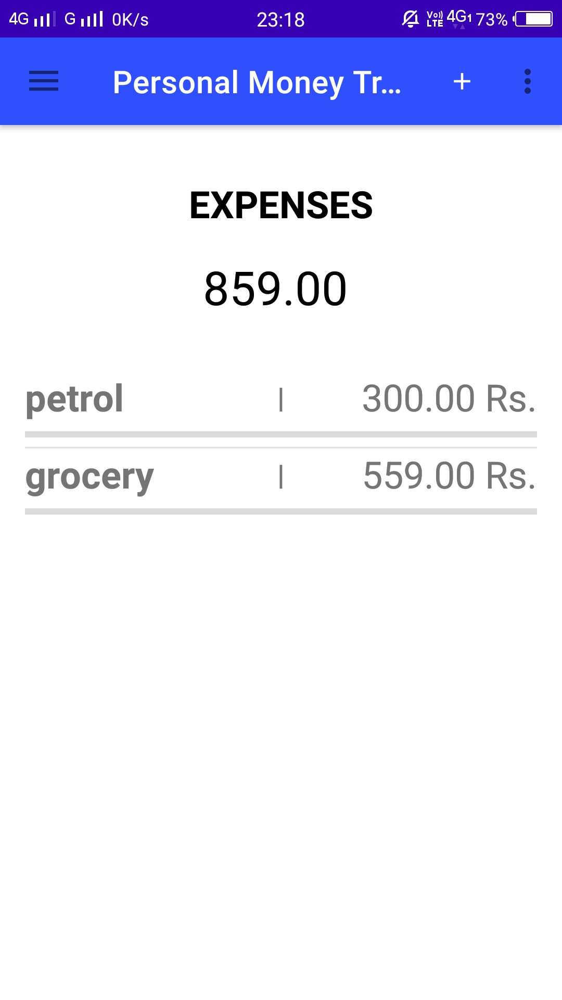
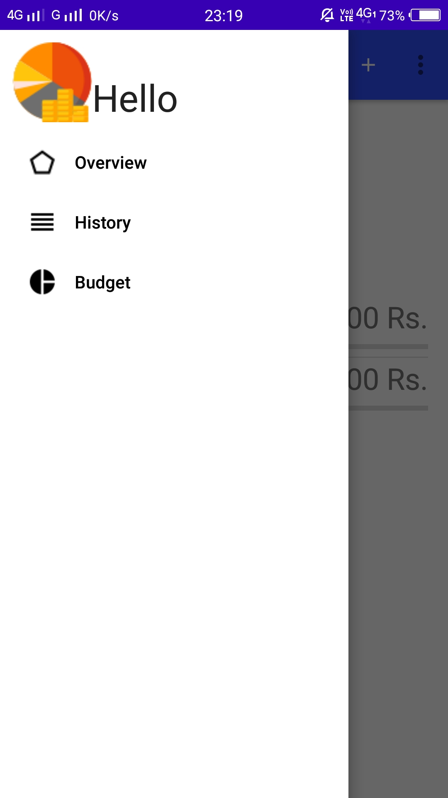
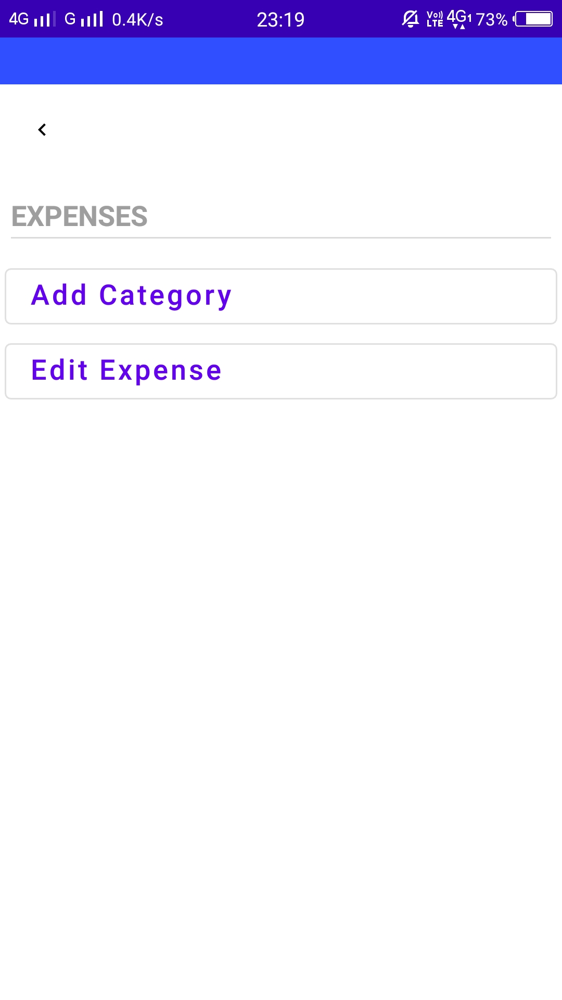
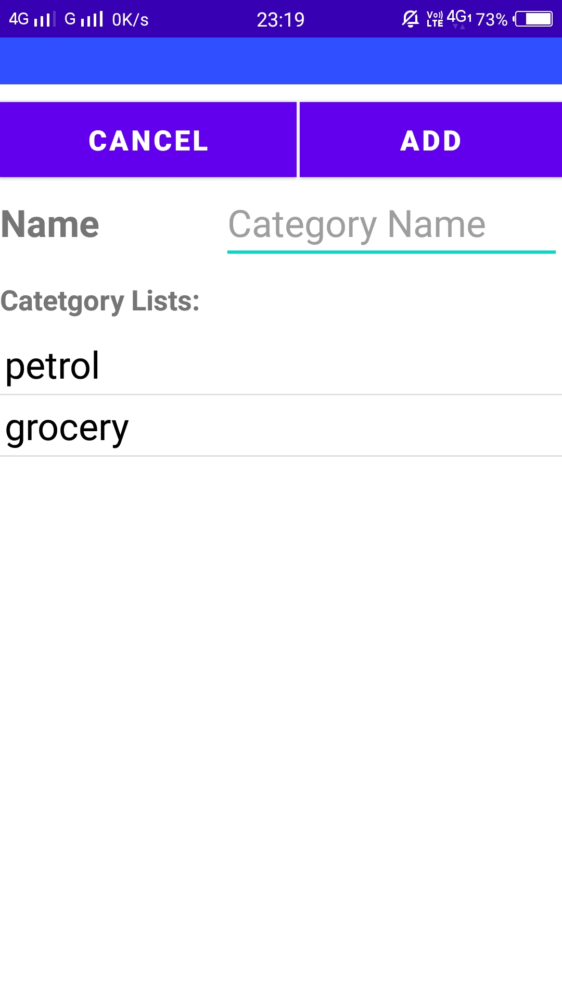
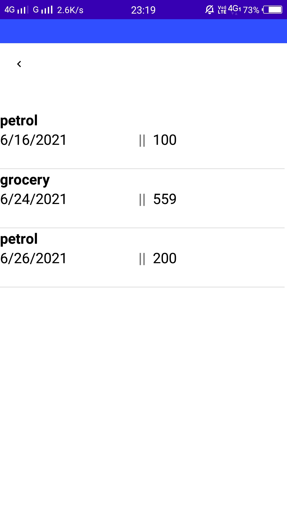
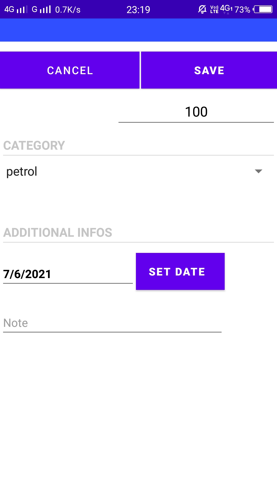
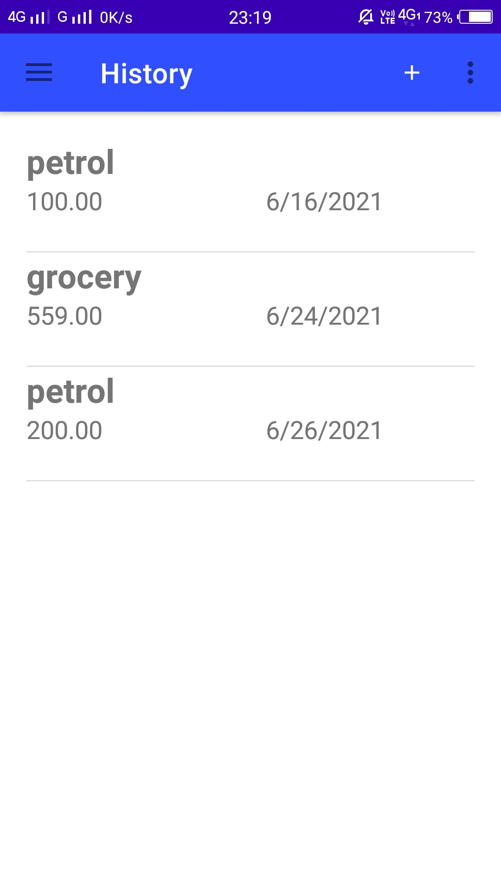
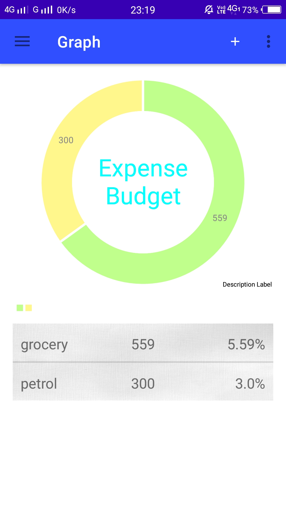

# Personal-Money-Tracker
An Android application that allows users to enter their daily expenses and maintain a record of their expenses.

## Objective
This mobile application makes it easier for the user to follow their mothly budget or revise their monthly budgets.

## Technology Stack
1. Android Studio
2. Java
3. SQLite
4. Php

## Major Functionalities
1. Add Category - Add category to differentiate multiple expenses (such as grocery, insurance, bills etc.).
2. Add Expense - Add Expense with details containing the categories, dates, and notes(if any).
3. Edit Expense - Edit your expenses or delete them.
4. Overview - Here, the user can see the list of his expenses with the selected categories.
5. History - Here, the user can see the history of his expenses or purchases that had been added before.
6. Budget - A pie chart depecting all the expenses of the user.

## Images

